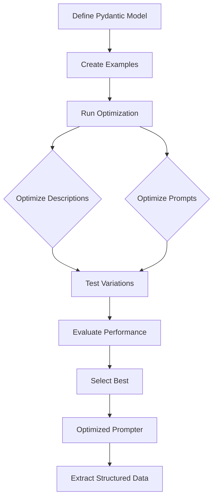

# Core Concepts

This page provides a brief overview of key concepts in DSPydantic. Understanding these will help you use the library more effectively.

## What is DSPydantic?

DSPydantic automatically **optimizes** Pydantic model field descriptions **and prompts** using DSPy's optimization algorithms. Instead of manually tuning descriptions and prompts, you provide examples and DSPydantic finds the best descriptions and prompts for your use case.

**Optimization is the core function** - efficient extraction is the outcome.

## Core Concepts Table

| Concept | What It Is | Why It Matters |
|---------|------------|----------------|
| **Optimization** | Process of automatically improving field descriptions and prompts | Core function - finds best descriptions and prompts automatically |
| **Extraction** | Process of getting structured data from inputs | Outcome of optimization - efficient data extraction |
| **Evaluators** | Measure how well extracted data matches expected data | Guide optimization - determine which variations work best |
| **Examples** | Training data with input and expected output | Drive optimization - examples determine what gets optimized |

## Key Concepts

### 1. Optimization (Core Function)

**Optimization** is the process of automatically improving field descriptions **and prompts** based on your examples. DSPydantic:

- Tests many variations of descriptions and prompts
- Evaluates each variation against your examples
- Selects the descriptions and prompts that perform best
- Iterates to refine the results

**When to use**: When you have 5-20 examples and want better extraction accuracy.

**Learn more**: [How Optimization Works](concepts/optimization.md)

### 2. Extraction (Outcome)

**Extraction** is the process of getting structured data from unstructured inputs (text, images, PDFs). This is the **outcome** of optimization:

- Takes your Pydantic model schema
- Uses **optimized** descriptions and prompts to guide the LLM
- Returns structured data matching your model

**Input types**: Text, images (PNG, JPG), PDFs (converted to images)

**Learn more**:
- [Optimization Modalities](guides/optimization/modalities.md)

### 3. Evaluators

**Evaluators** measure how well extracted data matches expected data. They return scores (0.0 to 1.0) that guide optimization.

**Types**:
- **Exact match** - For precise values (IDs, codes)
- **Fuzzy match** - For text with minor variations
- **Semantic similarity** - For text where meaning matters
- **LLM-based** - For complex, context-dependent evaluation

**Learn more**: [Understanding Evaluators](concepts/evaluators.md)

### 4. Examples

**Examples** are your training data. Each example contains:
- **Input**: **Text** (`text="..."`), **image** (`image_path="..."` or `image_base64`), **PDF** (`pdf_path="..."`), or a dictionary for template prompts
- **Expected output**: The correct structured data

**Best practices**:
- Use 5-20 examples for good results
- Cover diverse cases and edge cases
- Ensure examples are accurate

### 5. Prompter

The **Prompter** class is your main interface. It:
- **Optimizes** field descriptions and prompts
- Extracts structured data from inputs (outcome)
- Saves and loads optimized models

**Usage pattern**:
1. Create prompter with your model
2. **Optimize** with examples
3. Use optimized prompter for extraction

**Learn more**: [API Reference](reference/api/prompter.md)

## Optimization Workflow

## Optimization vs Manual Tuning

| Aspect | Manual Tuning | Optimization |
|--------|---------------|--------------|
| **Field Descriptions** | Write manually, guess what works | Automatically optimized based on examples |
| **Prompts** | Static, one-size-fits-all | Optimized, context-aware |
| **Time Investment** | Hours of trial and error | Minutes of automated optimization |
| **Accuracy** | Varies, depends on expertise | Consistently improved (typically 10-30%) |
| **Maintenance** | Manual updates needed | Re-optimize with new examples |
| **Consistency** | Varies by person | Consistent, data-driven |

## What Gets Optimized

DSPydantic optimizes **both models AND prompts**:

| Component | What Gets Optimized | Impact |
|-----------|-------------------|--------|
| **Field Descriptions** | Individual field descriptions | High - direct extraction accuracy |
| **System Prompt** | Overall context | Medium - task understanding |
| **Instruction Prompt** | Task instructions | Medium - extraction guidance |

All three work together synergistically to achieve accurate extraction.

## Supported Flows

Input formats (text, images, PDFs) are described in [Optimization Modalities](guides/optimization/modalities.md). From there you can use [With Pydantic Schema](guides/optimization/with-pydantic-schema.md) for structured output, [Without Pydantic Schema](guides/optimization/without-pydantic-schema.md) for string output, or [Prompt Templates](guides/optimization/prompt-templates.md) for dynamic `{placeholders}`.

## Next Steps

- **[Getting Started](index.md)** - Try your first optimization
- **[Your First Optimization](guides/optimization/first-optimization.md)** - Complete optimization workflow
- **[Optimization Modalities](guides/optimization/modalities.md)** - Input formats and flow overview
- **[Concepts](concepts/optimization.md)** - Deep dives into how things work
- **[Reference](reference/api/prompter.md)** - Complete API documentation
