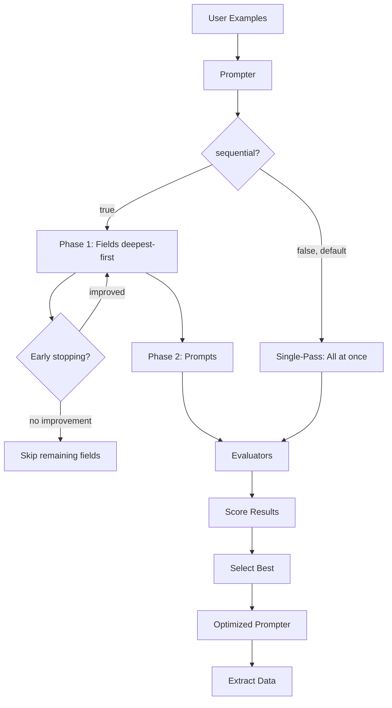

# How Optimization Works

This page explains how DSPydantic optimization works, why it's effective, and the design decisions behind it.

## How Optimization Works

DSPydantic uses DSPy's optimization algorithms to automatically improve field descriptions **and prompts**. You can choose between **single-pass mode** (default, fastest) and **sequential mode** (field-by-field, higher quality).

### Single-Pass Mode (`sequential=False`, default)

When `sequential=False` (default), all field descriptions and prompts are optimized together in one DSPy compile with reduced demo budgets (`max_bootstrapped_demos=1`). This is the fastest approach with lowest API costs.

### Sequential Mode (`sequential=True`)

When `sequential=True`:

1. **Phase 1 – Fields**: Each field description is optimized independently, ordered by nesting depth (deepest first). All other fields stay fixed. This minimizes the search space per run.
2. **Phase 2 – Prompts**: With field descriptions fixed, the system prompt and instruction prompt are optimized one at a time.
3. **Rolling baseline**: Each improvement becomes the baseline for the next step.
4. **Early stopping** (optional): With `early_stopping_patience=N`, optimization stops after N consecutive fields without improvement.

### Auto-Generated Prompts

With `auto_generate_prompts=True`, DSPydantic automatically creates system and instruction prompts from your model name and field names when they aren't provided. This gives the optimizer a meaningful starting point to improve upon.

## Optimization Flow

## Contextual Optimization

DSPydantic uses **contextual signatures** to give the optimizer domain awareness without bloating token usage. When optimizing field descriptions, the optimizer knows:

1. **Which model** is being optimized (e.g., `MedicalRecord`) — embedded in the signature class name (`OptimizeMedicalRecordFieldDescription`) at zero extra token cost
2. **Which field** is being optimized (e.g., `patient_name`) — passed as an input field (~2-5 tokens per call)
3. **The task domain** — a concise docstring (~25 tokens) tells the optimizer this is a structured extraction task

This is particularly important for MiPROv2, whose proposer generates instruction candidates based on the signature. Without context, it produces generic meta-instructions like "Given the fields `field_description`, produce `optimized_field_description`" instead of actual improved descriptions.

### Tie-Breaking: Prefer Simplicity

When multiple candidates achieve the same score, DSPydantic prefers the **shorter (simpler)** option. This applies to both field descriptions and prompts. Shorter descriptions are more token-efficient at inference time and tend to be less ambiguous.

## Why It Works

### The Problem with Manual Descriptions and Prompts

Writing good field descriptions and prompts is hard because:

- You need to anticipate how the LLM will interpret descriptions and prompts
- Different LLMs may interpret the same description or prompt differently
- Optimal descriptions and prompts depend on your specific data and use case
- Small wording changes can significantly affect extraction accuracy

### The Solution: Automated Optimization

DSPydantic solves this by:

- **Testing many variations**: The prompter tries many different phrasings automatically
- **Using your data**: Optimization is tailored to your specific examples
- **Measuring performance**: Each variation is evaluated objectively
- **Finding patterns**: The prompter learns what works best for your use case

## Design Decisions

### Why DSPy?

DSPy provides proven optimization algorithms that work well for prompt engineering. DSPydantic auto-selects based on your dataset:

| Examples | Auto-Selected | Reason |
|----------|---------------|--------|
| 1-2 | MIPROv2 (zero-shot) | Too few for bootstrapping |
| 3-19 | BootstrapFewShot | Fast, good for small sets |
| 20+ | BootstrapFewShotWithRandomSearch | More reliable with more data |

### Optimization Algorithms

| Algorithm | API Calls | Speed | Quality | Best For |
|-----------|-----------|-------|---------|----------|
| **BootstrapFewShot** | ~N | Fast | Good | Prototyping, small datasets |
| **BootstrapFewShotWithRandomSearch** | ~N×10 | Medium | Better | Production, reliable results |
| **MIPROv2 (light)** | ~50 | Medium | Better | Quick production |
| **MIPROv2 (medium)** | ~200 | Slow | Best | Balanced quality/cost |
| **MIPROv2 (heavy)** | ~500+ | Slowest | Best | Maximum quality |
| **COPRO** | ~M×K | Medium | Good | Debugging, understanding prompts |
| **GEPA** | ~20-100 | Medium | Good | Complex reasoning, interpretable |
| **BetterTogether** | Sum of all | Slowest | Best | Maximum quality, combines optimizers |
| **SIMBA** | Variable | Medium | Better | Large datasets (500+), batch |
| **Ensemble** | N per input | - | Best | Reliability, variance reduction |
| **BootstrapFinetune** | Variable | Slow | Best | 100+ examples, permanent improvements |

See [Configure Optimizations](../guides/advanced/configure-optimizations.md) for detailed optimizer configuration.

### Why Field Descriptions?

Field descriptions are the primary interface between your schema and the LLM. Optimizing them:

- Directly improves extraction accuracy
- Works with any LLM that supports structured outputs
- Is transparent and interpretable
- Can be version controlled and reviewed

### Why Prompts Too?

System and instruction prompts provide context. Optimizing them:

- Improves overall extraction quality
- Helps the LLM understand the task better
- Works synergistically with field descriptions
- Is essential for accurate extraction

## Trade-offs

### Advantages

- **Automatic**: No manual tuning required
- **Data-driven**: Based on your actual examples
- **Effective**: Typically improves accuracy significantly (10-30%)
- **Flexible**: Works with any Pydantic model
- **Comprehensive**: Optimizes both descriptions and prompts

### Limitations

- **Requires examples**: Need 5-20 examples for good results
- **Takes time**: Optimization can take several minutes
- **API costs**: Uses LLM API calls during optimization
- **Example quality matters**: Better examples lead to better optimization

## When to Use Optimization

Optimization is most valuable when:

- You have example data available (5-20 examples)
- Extraction accuracy is important
- You're willing to invest time upfront
- You want to improve over manual descriptions and prompts

Consider manual descriptions when:

- You have very few or no examples
- Speed is more important than accuracy
- You have domain expertise to write good descriptions
- You need immediate results

## Understanding Results

### Baseline Score

The baseline score shows how well your initial descriptions and prompts perform. This gives you a starting point.

### Optimized Score

The optimized score shows how well the optimized descriptions and prompts perform. This is what you'll get in production.

### Improvement

The improvement percentage shows the gain from optimization. Even small improvements (5-10%) can be significant in production.

### Optimized Descriptions and Prompts

The optimized descriptions and prompts are tailored to your use case. They may:

- Be more specific than your originals
- Include domain-specific terminology
- Emphasize important aspects
- Be longer or shorter depending on what works
- Work synergistically together

## Further Reading

- [Configure Optimizations](../guides/advanced/configure-optimizations.md) - Fast/default modes, optimizers, threads
- [Field Inclusion & Exclusion](../guides/advanced/field-exclusion.md) - Focus on specific fields
- [Architecture](architecture.md) - System design details
- [Understanding Evaluators](understanding-evaluators.md) - How evaluation works
- [Your First Optimization](../guides/optimization/first-optimization.md) - Complete workflow
- [Reference: Prompter](../reference/api/prompter.md) - Technical details
