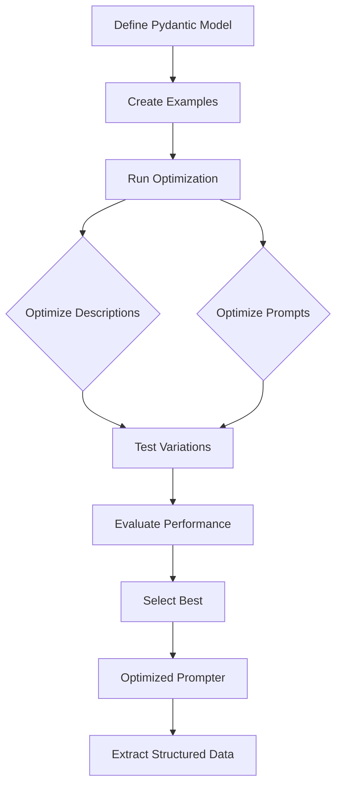

# Your First Optimization

In this tutorial, we'll walk through a complete optimization workflow. You'll learn how to optimize both field descriptions **and prompts**, and see how to use the optimized results for efficient extraction.

## What You'll Learn

By the end of this tutorial, you'll understand:

- How to optimize field descriptions
- How to optimize system and instruction prompts
- How to interpret optimization results
- How extraction is the outcome of optimization

## Optimization Workflow



## Step 1: Define a Model

Let's start with a product information extraction model:

```python
from pydantic import BaseModel, Field
from typing import Literal

class ProductInfo(BaseModel):
    name: str = Field(description="Full product name and model")
    storage: str = Field(description="Storage capacity like 256GB or 1TB")
    processor: str = Field(description="Chip or processor information")
    price: str = Field(description="Product price with currency")
    colors: list[str] = Field(description="Available color options")
    availability: Literal["in_stock", "pre_order", "sold_out"] = Field(
        description="Current availability status"
    )
```

Notice that we've provided initial descriptions. These are starting points - DSPydantic will optimize them based on your examples.

## Step 2: Create Examples

Create examples with input text and expected outputs:

```python
from dspydantic import Example

examples = [
    Example(
        text="iPhone 15 Pro Max with 256GB storage, A17 Pro chip, priced at $1199. Available in titanium and black colors.",
        expected_output=ProductInfo(
            name="iPhone 15 Pro Max",
            storage="256GB",
            processor="A17 Pro chip",
            price="$1199",
            colors=["titanium", "black"],
            availability="in_stock"
        )
    ),
    Example(
        text="MacBook Air M3, 512GB SSD, M3 processor, $1299. Colors: space gray, silver. Currently on pre-order.",
        expected_output=ProductInfo(
            name="MacBook Air M3",
            storage="512GB SSD",
            processor="M3 processor",
            price="$1299",
            colors=["space gray", "silver"],
            availability="pre_order"
        )
    ),
]
```

## Step 3: Optimize with Prompts

Create a prompter with initial system and instruction prompts:

```python
from dspydantic import Prompter

prompter = Prompter(
    model=ProductInfo,
    model_id="gpt-4o",
)

result = prompter.optimize(
    examples=examples,
    system_prompt="You are a product information extraction assistant.",
    instruction_prompt="Extract product details from the description.",
)
```

Notice that we're providing initial prompts. DSPydantic will optimize these **along with** the field descriptions.

## Step 4: Run Optimization

The optimization runs when you call `prompter.optimize()`. You'll see progress as it runs. The prompter tests different combinations of descriptions **and prompts** to find what works best.

## Step 5: Examine Results

Let's look at what changed:

```python
print("Optimized System Prompt:")
print(result.optimized_system_prompt)
print("\nOptimized Instruction Prompt:")
print(result.optimized_instruction_prompt)
print("\nOptimized Descriptions:")
for field_path, description in result.optimized_descriptions.items():
    print(f"  {field_path}: {description}")

print(f"\nBaseline Score: {result.baseline_score:.2%}")
print(f"Optimized Score: {result.optimized_score:.2%}")
print(f"Improvement: {result.metrics['improvement']:+.2%}")
```

You should see that both the prompts and descriptions have been optimized for better accuracy.

## Optimization Results

| Metric | Value | What It Means |
|--------|-------|---------------|
| **Baseline Score** | Initial performance | How well your original descriptions and prompts perform |
| **Optimized Score** | Final performance | How well optimized descriptions and prompts perform |
| **Improvement** | Gain percentage | The improvement from optimization (typically 10-30%) |

## Before/After Examples

| Field | Before Optimization | After Optimization |
|-------|-------------------|-------------------|
| `name` | "Full product name and model" | "Complete product name including brand, model number, and variant designation" |
| `storage` | "Storage capacity like 256GB or 1TB" | "Storage capacity specification including unit (GB, TB) and type (SSD, HDD) if mentioned" |
| `price` | "Product price with currency" | "Product price including currency symbol and amount, formatted as shown in the description" |

## Step 6: Use the Optimized Prompter

Now use the optimized prompter to extract data (extraction is the outcome):

```python
# Extract from new text
product = prompter.run(
    "Samsung Galaxy S24 Ultra, 1TB storage, Snapdragon 8 Gen 3 processor, "
    "$1299. Available in titanium black, titanium gray, and titanium violet. In stock now."
)
print(product)
```

The prompter uses the optimized prompts and descriptions automatically.

## What Gets Optimized

| Component | What Gets Optimized | Impact |
|-----------|-------------------|--------|
| **Field Descriptions** | Individual field descriptions | High - direct extraction accuracy |
| **System Prompt** | Overall context | Medium - task understanding |
| **Instruction Prompt** | Task instructions | Medium - extraction guidance |

All three work together synergistically to achieve accurate extraction.

## What You've Learned

You've successfully:

1. Optimized both field descriptions **and prompts**
2. Seen how optimization improves extraction accuracy
3. Used the optimized results for efficient extraction

## Next Steps

| Guide | What You'll Learn |
|-------|-------------------|
| [Optimization Modalities](modalities.md) | Text, images, PDFs |
| [Optimize with Templates](prompt-templates.md) | Optimize with dynamic prompts |
| [Configure Evaluators](../evaluators/configure.md) | Customize evaluation strategies |
| [Advanced Optimization](../advanced/nested-models.md) | Complex scenarios |

## See Also

- [How Optimization Works](../../concepts/optimization.md) - Deep dive into optimization
- [Core Concepts](../../core-concepts.md) - Key concepts overview
- [Reference: Prompter](../../reference/api/prompter.md) - Complete API documentation
