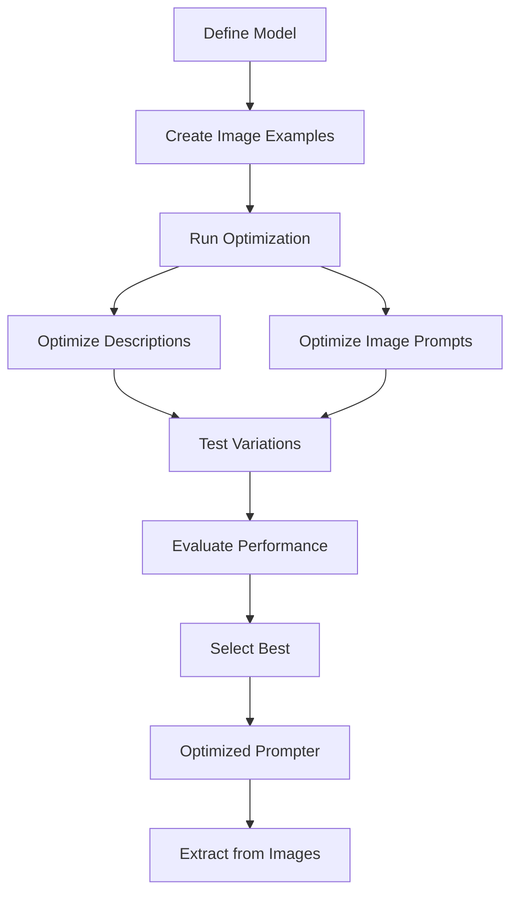

# Optimize with Images

This guide shows you how to optimize your Pydantic models and prompts using image examples. After optimization, you'll achieve efficient extraction of structured data from images, including classification tasks.

## When to Use Image Optimization

| Data Type | Best For | Optimization Focus | Extraction Outcome |
|-----------|----------|-------------------|-------------------|
| Text | Documents, emails, reports | Field descriptions + prompts | Structured text data |
| **Images** | Classification, OCR | Image-specific prompts | Labels, classifications |
| PDFs | Forms, invoices, reports | Multi-page optimization | Document data |
| Templates | Dynamic contexts | Placeholder optimization | Context-aware data |

Use image optimization when you have images and want to classify them or extract structured information.

## Optimization Workflow



## Problem

You have images and need to extract structured data or classify them into categories. You want to improve accuracy through optimization of field descriptions **and prompts**.

## Solution

Use `Prompter` with image examples to optimize your model and prompts, then extract data efficiently.

## Steps

### 1. Define Your Model

For classification tasks, use `Literal` types to restrict output to valid categories:

```python
from pydantic import BaseModel, Field
from typing import Literal

class DigitClassification(BaseModel):
    """Digit classification model for MNIST handwritten digits."""
    
    digit: Literal[0, 1, 2, 3, 4, 5, 6, 7, 8, 9] = Field(
        description="The digit shown in the image, a number from 0 to 9"
    )
```

Notice we're using `Literal[0, 1, 2, 3, 4, 5, 6, 7, 8, 9]` to restrict the output to valid digits.

### 2. Create Image Examples

Create examples with images. You can use image paths or base64-encoded images:

```python
from dspydantic import Example

# Option 1: Using image paths
examples = [
    Example(
        image_path="digit_5.png",
        expected_output={"digit": 5}
    ),
    Example(
        image_path="digit_3.png",
        expected_output={"digit": 3}
    ),
]
```

Or with base64-encoded images:

```python
import base64

def load_image_as_base64(image_path: str) -> str:
    with open(image_path, "rb") as f:
        return base64.b64encode(f.read()).decode("utf-8")

examples = [
    Example(
        image_base64=load_image_as_base64("digit_5.png"),
        expected_output={"digit": 5}
    ),
]
```

### 3. Create Prompter and Optimize

Create a prompter with image-specific prompts:

```python
from dspydantic import Prompter

prompter = Prompter(
    model=DigitClassification,
    model_id="gpt-4o",
)

result = prompter.optimize(
    examples=examples,
    system_prompt=(
        "You are an expert image classification assistant specializing in handwritten "
        "digit recognition. You have extensive experience analyzing MNIST-style "
        "handwritten digit images and can accurately identify digits from 0 to 9 even "
        "when the handwriting is unclear or stylized."
    ),
    instruction_prompt=(
        "Analyze the provided handwritten digit image and identify the digit shown. "
        "The digit will be a single number from 0 to 9. Look carefully at the shape, "
        "strokes, and overall form of the handwritten digit to make an accurate "
        "classification. Return the digit value as specified in the JSON schema."
    ),
)
```

The optimization process tests variations of field descriptions **and prompts** to find what works best for image classification.

### 4. View Optimization Results

Check the optimization results:

```python
print(f"Baseline score: {result.baseline_score:.2%}")
print(f"Optimized score: {result.optimized_score:.2%}")
print(f"Improvement: {result.metrics['improvement']:+.2%}")

print("\nOptimized system prompt:")
print(result.optimized_system_prompt)

print("\nOptimized instruction prompt:")
print(result.optimized_instruction_prompt)

print("\nOptimized descriptions:")
for field_path, description in result.optimized_descriptions.items():
    print(f"  {field_path}: {description}")
```

### 5. Extract from Images (Outcome)

After optimization, extract data efficiently from new images:

```python
# Extract from new image
digit = prompter.run(image_path="new_digit.png")
print(digit)
```

The prompter uses the optimized prompts and descriptions automatically.

## What Gets Optimized

| Parameter | What Gets Optimized | Impact |
|-----------|-------------------|--------|
| Field Descriptions | Individual field descriptions | High - direct extraction accuracy |
| System Prompt | Image analysis context | Medium - task understanding |
| Instruction Prompt | Image classification instructions | Medium - extraction guidance |

## Tips for Image Optimization

- Use clear, descriptive system prompts that mention image analysis
- Ensure your examples cover all possible classes (0-9 in this case)
- Consider image quality and preprocessing in your examples
- Test with various image styles and qualities
- PDFs are converted to images automatically - see [Optimize with PDFs](pdfs.md)

## See Also

- [Optimize with Text](text.md) - Optimize with text documents
- [Optimize with PDFs](pdfs.md) - Optimize with PDF documents
- [Optimize with Templates](templates.md) - Optimize with dynamic prompts
- [Your First Optimization](first-optimization.md) - Complete optimization workflow
- [Reference: Prompter](../../reference/api/prompter.md) - Complete API documentation
- [Reference: Example](../../reference/api/types.md#example) - Example input options
