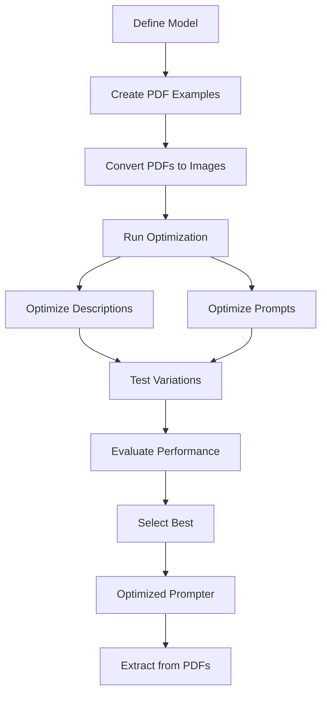

# Optimize with PDFs

This guide shows you how to optimize your Pydantic models and prompts using PDF examples. After optimization, you'll achieve efficient extraction of structured data from PDF documents.

## When to Use PDF Optimization

| Data Type | Best For | Optimization Focus | Extraction Outcome |
|-----------|----------|-------------------|-------------------|
| Text | Documents, emails, reports | Field descriptions + prompts | Structured text data |
| Images | Classification, OCR | Image-specific prompts | Labels, classifications |
| **PDFs** | Forms, invoices, reports | Multi-page optimization | Document data |
| Templates | Dynamic contexts | Placeholder optimization | Context-aware data |

Use PDF optimization when you have PDF documents and want to extract structured information. PDFs are automatically converted to images for processing.

## Optimization Workflow



## Problem

You have PDF documents (invoices, forms, reports, etc.) and need to extract structured data from them. You want to improve accuracy through optimization of field descriptions **and prompts**.

## Solution

Use `Prompter` with PDF examples. DSPydantic automatically converts PDFs to images at a specified DPI for processing, then optimizes your model and prompts.

## Steps

### 1. Define Your Model

```python
from pydantic import BaseModel, Field

class InvoiceRecord(BaseModel):
    invoice_number: str = Field(description="Invoice number or ID")
    date: str = Field(description="Invoice date")
    total_amount: str = Field(description="Total amount due")
    vendor_name: str = Field(description="Vendor or company name")
    items: list[str] = Field(description="List of line items")
```

### 2. Create PDF Examples

Use `pdf_path` to specify PDF files:

```python
from dspydantic import Example

examples = [
    Example(
        pdf_path="invoice_001.pdf",
        pdf_dpi=300,  # Optional: DPI for conversion (default: 300)
        expected_output={
            "invoice_number": "INV-2024-001",
            "date": "2024-01-15",
            "total_amount": "$1,250.00",
            "vendor_name": "Acme Corp",
            "items": ["Product A - $500", "Product B - $750"]
        }
    ),
    Example(
        pdf_path="invoice_002.pdf",
        expected_output={
            "invoice_number": "INV-2024-002",
            "date": "2024-01-20",
            "total_amount": "$890.50",
            "vendor_name": "Tech Solutions Inc",
            "items": ["Service Fee - $890.50"]
        }
    ),
]
```

### 3. Create Prompter and Optimize

```python
from dspydantic import Prompter

prompter = Prompter(
    model=InvoiceRecord,
    model_id="gpt-4o",
)

result = prompter.optimize(
    examples=examples,
    system_prompt="You are an expert at extracting information from invoice documents.",
    instruction_prompt="Extract all invoice details from the provided document.",
)
```

The optimization process tests variations of field descriptions **and prompts** to find what works best for PDF document extraction.

### 4. Extract from PDFs (Outcome)

After optimization, extract data efficiently from new PDFs:

```python
# Extract from new PDF
invoice = prompter.run(pdf_path="new_invoice.pdf")
print(invoice.invoice_number)
print(invoice.total_amount)
```

## How PDF Processing Works

1. **PDF Conversion**: PDFs are converted to images at the specified DPI (default: 300)
2. **Multi-page Support**: Each page becomes a separate image
3. **Image Processing**: The images are processed just like regular image inputs
4. **Optimization**: Field descriptions and prompts are optimized for PDF extraction
5. **Extraction**: Structured data is extracted from the converted images

## DPI Settings

| DPI | Quality | File Size | Use Case |
|-----|---------|-----------|----------|
| **300** (default) | Good balance | Medium | Most documents |
| **600+** | High quality | Large | Small text, detailed documents |
| **150-200** | Lower quality | Small | Faster processing, may miss small text |

```python
# High DPI for detailed documents
Example(pdf_path="detailed_report.pdf", pdf_dpi=600, expected_output={...})

# Standard DPI (default)
Example(pdf_path="invoice.pdf", expected_output={...})  # Uses 300 DPI
```

## Combining PDFs with Text

You can combine PDFs with additional text context:

```python
examples = [
    Example(
        text="This is an invoice from Q1 2024",
        pdf_path="invoice.pdf",
        expected_output={...}
    ),
]
```

## What Gets Optimized

| Parameter | What Gets Optimized | Impact |
|-----------|-------------------|--------|
| Field Descriptions | Individual field descriptions | High - direct extraction accuracy |
| System Prompt | Document extraction context | Medium - task understanding |
| Instruction Prompt | PDF-specific instructions | Medium - extraction guidance |

## Tips

- Use 300 DPI for most documents (good balance)
- Higher DPI (600+) for documents with small text
- Ensure PDFs are readable (not scanned images of poor quality)
- Multi-page PDFs are processed page by page
- See [Optimize with Images](images.md) for image-specific tips

## See Also

- [Optimize with Text](text.md) - Optimize with text documents
- [Optimize with Images](images.md) - Optimize with image inputs
- [Optimize with Templates](templates.md) - Optimize with dynamic prompts
- [Your First Optimization](first-optimization.md) - Complete optimization workflow
- [Reference: Prompter](../../reference/api/prompter.md) - Complete API documentation
- [Reference: Example](../../reference/api/types.md#example) - Example input options
