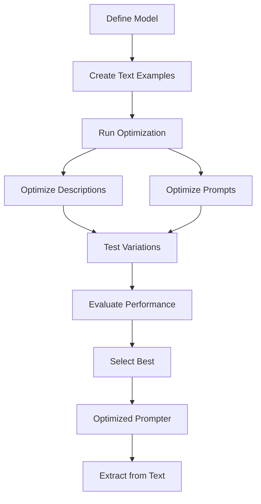

# Optimize with Text

This guide shows you how to optimize your Pydantic models and prompts using text examples. After optimization, you'll achieve efficient extraction of structured data from text documents.

## When to Use Text Optimization

| Data Type | Best For | Optimization Focus | Extraction Outcome |
|-----------|----------|-------------------|-------------------|
| **Text** | Documents, emails, reports | Field descriptions + prompts | Structured text data |
| Images | Classification, OCR | Image-specific prompts | Labels, classifications |
| PDFs | Forms, invoices, reports | Multi-page optimization | Document data |
| Templates | Dynamic contexts | Placeholder optimization | Context-aware data |

Use text optimization when you have text documents and want to extract structured information.

## Optimization Workflow



## Problem

You have text documents and need to extract structured data from them. You want to improve extraction accuracy by optimizing field descriptions **and prompts**.

## Solution

Use `Prompter` with text examples to automatically find better field descriptions **and prompts**, then extract data efficiently.

## Steps

### 1. Define Your Model

```python
from pydantic import BaseModel, Field

class TransactionRecord(BaseModel):
    broker: str = Field(description="Financial institution")
    amount: str = Field(description="Transaction amount")
    security: str = Field(description="Financial instrument")
    date: str = Field(description="Transaction date")
```

### 2. Create Text Examples

```python
from dspydantic import Example

examples = [
    Example(
        text="Goldman Sachs processed a $2.5M equity trade for Tesla Inc. on March 15, 2024.",
        expected_output={
            "broker": "Goldman Sachs",
            "amount": "$2.5M",
            "security": "Tesla Inc.",
            "date": "March 15, 2024"
        }
    ),
    Example(
        text="JPMorgan executed $500K bond purchase for Apple Corp dated 2024-03-20.",
        expected_output={
            "broker": "JPMorgan",
            "amount": "$500K",
            "security": "Apple Corp",
            "date": "2024-03-20"
        }
    ),
]
```

### 3. Create Prompter and Optimize

```python
from dspydantic import Prompter

prompter = Prompter(
    model=TransactionRecord,
    model_id="gpt-4o",
)

result = prompter.optimize(examples=examples)
```

The optimization process tests variations of field descriptions **and prompts** to find what works best for your text data.

### 4. Extract Data (Outcome)

After optimization, extract structured data efficiently:

```python
# Extract from new text
data = prompter.run("Morgan Stanley executed $1M option trade for Microsoft Corp on 2024-04-01")
print(data)
```

## What Gets Optimized

| Parameter | What Gets Optimized | Impact |
|-----------|-------------------|--------|
| Field Descriptions | Individual field descriptions | High - direct extraction accuracy |
| System Prompt | Overall context | Medium - task understanding |
| Instruction Prompt | Task instructions | Medium - extraction guidance |

## Optimization Results Example

| Aspect | Before Optimization | After Optimization |
|--------|---------------------|-------------------|
| Field Descriptions | Generic, manual | Optimized, data-specific |
| Prompts | Static, one-size-fits-all | Optimized, context-aware |
| Accuracy | Baseline (varies) | Improved (typically 10-30%) |

## Tips

- Provide diverse examples covering different text formats
- Include edge cases in your examples
- Use 5-20 examples for best results
- See [Reference: Prompter](../../reference/api/prompter.md) for all options

## See Also

- [Optimize with Images](images.md) - Optimize with image inputs
- [Optimize with PDFs](pdfs.md) - Optimize with PDF documents
- [Optimize with Templates](templates.md) - Optimize with dynamic prompts
- [Your First Optimization](first-optimization.md) - Complete optimization workflow
- [Configure Evaluators](../evaluators/configure.md) - Customize evaluation
- [Reference: Prompter](../../reference/api/prompter.md) - Complete API documentation

