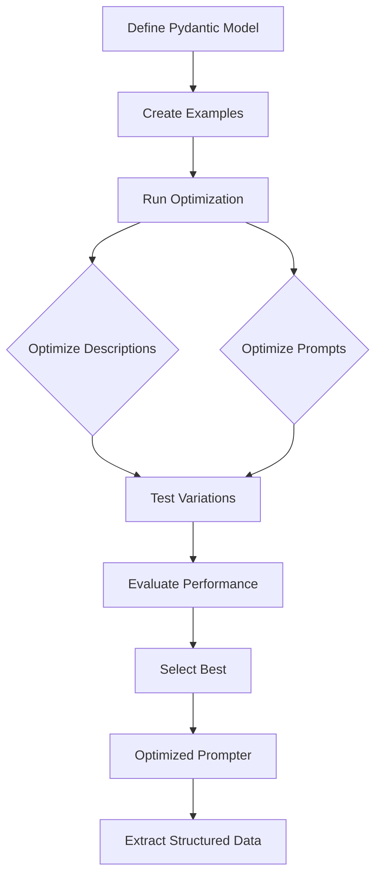

# DSPydantic: Auto-Optimize Your Pydantic Models and Prompts with DSPy

Automatically optimize Pydantic model field descriptions **and prompts** using DSPy. Get better structured data extraction from LLMs with less manual tuning.

## What It Does

Instead of spending hours crafting the perfect field descriptions and prompts for your Pydantic models, DSPydantic uses DSPy's optimization algorithms to automatically find the best descriptions **and prompts** based on your examples. Just provide a few examples, and watch your extraction accuracy improve.

## Core Function: Optimization

**Optimization is the core function** of DSPydantic. Efficient extraction is the outcome. DSPydantic optimizes:

- **Field descriptions** - Individual field descriptions in your Pydantic models
- **System prompts** - Overall context and task understanding
- **Instruction prompts** - Task-specific instructions

After optimization, you get an optimized prompter that efficiently extracts structured data.

## Optimization Flow



## Quick Start

```python
from pydantic import BaseModel, Field
from dspydantic import Prompter, Example

# 1. Define your model (any Pydantic model works)
class TransactionRecord(BaseModel):
    broker: str = Field(description="Financial institution or brokerage firm")
    amount: str = Field(description="Transaction amount with currency")
    security: str = Field(description="Stock, bond, or financial instrument")
    date: str = Field(description="Transaction date")

# 2. Provide examples (just input text + expected output)
examples = [
    Example(
        text="Transaction Report: Goldman Sachs processed a $2.5M equity trade for Tesla Inc. on March 15, 2024.",
        expected_output={
            "broker": "Goldman Sachs",
            "amount": "$2.5M",
            "security": "Tesla Inc.",
            "date": "March 15, 2024"
        }
    ),
]

# 3. Create prompter, optimize, and use
prompter = Prompter(
    model=TransactionRecord,
    model_id="gpt-4o",
)

result = prompter.optimize(examples=examples)

# 4. Run extraction (outcome of optimization)
data = prompter.run("JPMorgan executed $500K bond purchase for Apple Corp on 2024-03-20")
```

**That's it!** Your prompter now extracts data accurately with optimized descriptions **and prompts**.

## Installation

```bash
pip install dspydantic
```

Or with `uv`:

```bash
uv pip install dspydantic
```

## Key Features

- **Auto-optimization**: Finds best field descriptions **and prompts** automatically
- **Unified Prompter class**: Single class for both optimization and extraction
- **Save & Load**: Save optimized prompters for production deployment
- **Pre-defined feedback**: Use pre-computed scores for evaluation
- **Simple input**: Just examples (text/images/PDFs) + your Pydantic model
- **Better output**: Optimized model ready to use with improved accuracy
- **Prompt templates**: Dynamic prompts with `{placeholders}` for context-aware extraction
- **Enum & Literal support**: Optimize classification models
- **Multiple formats**: Text, images, PDFs—works with any input type
- **Smart defaults**: Auto-selects best optimizer, no configuration needed

## Guide Progression

| Step | Guide | What You'll Learn |
|------|-------|-------------------|
| 1 | [Your First Optimization](guides/optimization/first-optimization.md) | Quick optimization example |
| 2 | [Your First Optimization](guides/optimization/first-optimization.md) | Complete optimization workflow |
| 3 | [Optimization Modalities](guides/optimization/modalities.md) | Data-specific optimization |
| 4 | [Configure Evaluators](guides/evaluators/configure.md) | Customize evaluation |
| 5 | [Advanced Topics](guides/advanced/nested-models.md) | Complex scenarios |

## Data Type Comparison

| Data Type | Best For | Optimization Focus | Extraction Outcome |
|-----------|----------|-------------------|-------------------|
| **Text** | Documents, emails, reports | Field descriptions + prompts | Structured text data |
| **Images** | Classification, OCR | Image-specific prompts | Labels, classifications |
| **PDFs** | Forms, invoices, reports | Multi-page optimization | Document data |
| **Templates** | Dynamic contexts | Placeholder optimization | Context-aware data |

## Optimization Outcomes

| Aspect | Before Optimization | After Optimization |
|--------|---------------------|-------------------|
| Field Descriptions | Generic, manual | Optimized, data-specific |
| Prompts | Static, one-size-fits-all | Optimized, context-aware |
| Accuracy | Baseline (varies) | Improved (typically 10-30%) |
| Maintenance | Manual tuning | Automated optimization |

## Getting Started

New to DSPydantic? Start here:

1. **[Your First Optimization](guides/optimization/first-optimization.md)** - Quick start with a complete example
2. **[Core Concepts](core-concepts.md)** - Learn key concepts and workflows
3. **[Your First Optimization](guides/optimization/first-optimization.md)** - Complete optimization workflow

## Optimization Guides

### Your First Optimization

- **[Your First Optimization](guides/optimization/first-optimization.md)** - Complete workflow for optimizing models and prompts

### Optimization Flows by Data Type

Optimize your model with different data types:

- **[Optimization Modalities](guides/optimization/modalities.md)** - Text, images, PDFs
- **[Optimize with Templates](guides/optimization/templates.md)** - Optimize with dynamic prompts

### Evaluators

Customize how optimization evaluates results:

- **[Configure Evaluators](guides/evaluators/configure.md)** - Set up evaluators for your fields
- **[When to Use Which](guides/evaluators/selection.md)** - Choose the right evaluator
- **[Custom Evaluators](guides/evaluators/custom.md)** - Create custom evaluation logic

### Advanced Optimization

- **[Nested Models](guides/advanced/nested-models.md)** - Optimize complex nested structures
- **[Field Exclusion](guides/advanced/field-exclusion.md)** - Exclude fields from evaluation

## Production Guides

Deploy optimized models to production:

- **[Save and Load Prompters](guides/advanced/save-load.md)** - Persist optimized models

## Concepts

Understand how DSPydantic works:

- **[How Optimization Works](concepts/optimization.md)** - Deep dive into optimization
- **[Understanding Evaluators](concepts/evaluators.md)** - Evaluation strategies explained
- **[Architecture](concepts/architecture.md)** - System design and components

## API Reference

Complete API documentation:

- **[Prompter](reference/api/prompter.md)** - Unified optimization and extraction
- **[Types](reference/api/types.md)** - Core types and data structures
- **[Extractor](reference/api/extractor.md)** - Field extraction utilities
- **[Evaluators](reference/api/evaluators.md)** - Evaluation system

## License

Apache 2.0

## Contributing

Contributions are welcome! Please open an issue or submit a pull request.
