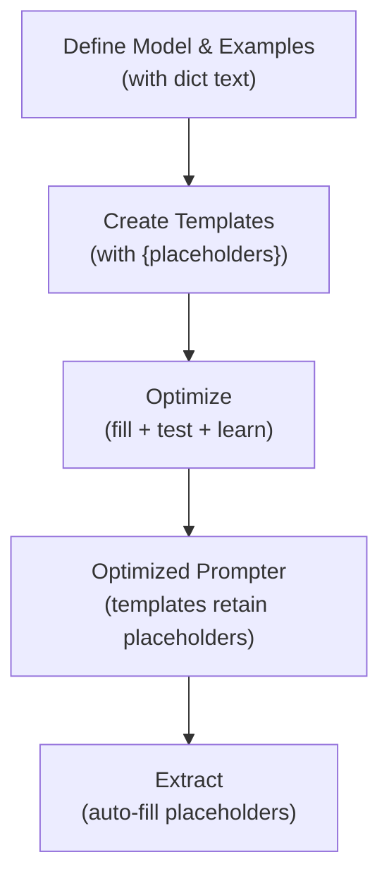

# Optimize with Prompt Templates

Learn how to use dynamic prompt templates with placeholders that change based on your input data.

## What You'll Learn

Sometimes you want prompts that **adapt to your data**. For example:

- Analyzing reviews from different product categories → customize the prompt per category
- Processing documents from different departments → include context per department
- Extracting from forms with different fields → adapt instructions per field type

This tutorial teaches you how to optimize prompts with **dynamic placeholders** like `{category}`, `{product}`, `{review}`.

## Why Template Optimization?

Instead of a fixed system prompt:

```python
# ❌ Static prompt (same for all inputs)
"You are a product review analyst."
```

Use dynamic templates:

```python
# ✅ Dynamic prompt (adapts to each input)
"You are an expert analyst specializing in {category} reviews."
```

During optimization, DSPydantic learns which template variations work best. Then during extraction, the placeholders are filled from your input data.

---

## Step 1: Define Your Model

Create a Pydantic model for your structured output:

```python
from pydantic import BaseModel, Field
from typing import Literal

class ProductReview(BaseModel):
    """Extract product review data."""
    sentiment: Literal["positive", "negative", "neutral"] = Field(
        description="Review sentiment"
    )
    rating: int = Field(description="Rating 1-5")
    aspects: list[Literal["camera", "performance", "battery"]] = Field(
        description="Product aspects mentioned"
    )
```

---

## Step 2: Create Examples with Dictionary Text

Instead of plain text, use dictionaries with keys that become placeholders:

```python
from dspydantic import Example

examples = [
    Example(
        text={
            "review": "Amazing camera quality and blazingly fast performance!",
            "product": "iPhone 15 Pro",
            "category": "smartphone"
        },
        expected_output={
            "sentiment": "positive",
            "rating": 4,
            "aspects": ["camera", "performance"]
        }
    ),
    Example(
        text={
            "review": "Poor battery life, way too expensive.",
            "product": "Samsung Galaxy S24",
            "category": "smartphone"
        },
        expected_output={
            "sentiment": "negative",
            "rating": 2,
            "aspects": ["battery"]
        }
    ),
    Example(
        text={
            "review": "Works okay, nothing special.",
            "product": "Google Pixel 8",
            "category": "smartphone"
        },
        expected_output={
            "sentiment": "neutral",
            "rating": 3,
            "aspects": ["performance"]
        }
    ),
]
```

**Key point:** The dictionary keys (`review`, `product`, `category`) become available as placeholders.

---

## Step 3: Define Prompt Templates and Optimize

Create prompt templates with `{placeholders}` matching your dictionary keys:

```python
import dspy
from dspydantic import Prompter

# Configure language model
dspy.configure(lm=dspy.LM("openai/gpt-4o-mini", api_key="your-api-key"))

# Create prompter
prompter = Prompter(
    model=ProductReview,
    model_id="openai/gpt-4o-mini",
)

# Optimize with templates
result = prompter.optimize(
    examples=examples,
    system_prompt="You are an expert analyst specializing in {category} reviews.",
    instruction_prompt="Analyze the {category} product review about {product}: {review}",
)
```

During optimization:
1. The placeholders are **filled** from each example's dictionary
2. DSPydantic tests different field descriptions and template variations
3. The optimized prompts **retain placeholders** for reuse at extraction time

---

## Step 4: Extract with Dynamic Prompts

After optimization, use the prompter with new data. Placeholders are automatically filled:

```python
# Extract with dynamic prompts
data = prompter.run(
    text={
        "category": "smartphone",
        "product": "iPhone 15 Pro",
        "review": "Great camera and battery lasted all day!"
    }
)

print(data)
# ProductReview(sentiment='positive', rating=4, aspects=['camera', 'battery'])
```

The prompter fills `{category}`, `{product}`, and `{review}` from the dictionary you provide, making the prompts context-aware.

---

## How It Works

Here's the flow:



| Step | What Happens |
|------|--------------|
| **Define** | Model structure and dictionary-based examples |
| **Template** | System and instruction prompts with `{placeholders}` |
| **Optimize** | Placeholders are filled for each example; variations are tested |
| **Result** | Optimized prompts keep placeholders for reuse |
| **Extract** | You provide a dict; placeholders are auto-filled |

---

## What Gets Optimized

| Parameter | What | Impact |
|-----------|------|--------|
| Field Descriptions | How each field is described | High |
| System Prompt Template | Template structure and wording | Medium |
| Instruction Prompt Template | Template structure and wording | Medium |

---

## Complete Example: Multi-Category Reviews

Here's a full example handling reviews from different product categories:

```python
from pydantic import BaseModel, Field
from typing import Literal
from dspydantic import Example, Prompter
import dspy

# Model
class Review(BaseModel):
    sentiment: Literal["positive", "negative", "neutral"] = Field(
        description="Overall sentiment"
    )
    rating: int = Field(description="Rating 1-5")

# Examples from different categories
examples = [
    Example(
        text={
            "category": "laptop",
            "product": "Dell XPS 15",
            "review": "Excellent performance, runs any software smoothly."
        },
        expected_output={"sentiment": "positive", "rating": 5}
    ),
    Example(
        text={
            "category": "laptop",
            "product": "MacBook Pro",
            "review": "Expensive and battery drains quickly."
        },
        expected_output={"sentiment": "negative", "rating": 2}
    ),
    Example(
        text={
            "category": "phone",
            "product": "Samsung Galaxy",
            "review": "Works well for daily tasks, nothing exceptional."
        },
        expected_output={"sentiment": "neutral", "rating": 3}
    ),
]

# Configure and optimize
dspy.configure(lm=dspy.LM("openai/gpt-4o-mini"))

prompter = Prompter(model=Review)
result = prompter.optimize(
    examples=examples,
    system_prompt="You are a product review analyst for {category}s.",
    instruction_prompt="Rate this {category} review: {review}",
)

# Extract from new reviews
phone_review = prompter.run(text={
    "category": "phone",
    "product": "iPhone 16",
    "review": "Amazing camera, super fast processor!"
})

laptop_review = prompter.run(text={
    "category": "laptop",
    "product": "Framework",
    "review": "Overpriced and has driver issues."
})

print(phone_review)    # sentiment='positive', rating=5
print(laptop_review)   # sentiment='negative', rating=2
```

---

## Tips

- **Consistent keys:** All examples should have the same dictionary keys
- **Meaningful names:** Use descriptive key names that match placeholders (`{category}`, not `{c}`)
- **Case-sensitive:** Placeholders `{category}` and `{Category}` are different
- **Optional placeholders:** Not all prompts need all placeholders
- **Avoid duplicates:** Don't repeat the same placeholder or hardcode values

---

## Next Steps

| Topic | Guide |
|-------|-------|
| First optimization | [Extract Structured Data](extract-structured-data.md) |
| Text-only output | [Extract Free-form Text](extract-free-form-text.md) |
| Advanced templates | [Configure Optimization Parameters](../how-to/configure-optimizations.md) |
| Production deployment | [Save and Load a Prompter](../how-to/save-and-load.md) |

---

## Troubleshooting

**Placeholder not being filled?**

- Check spelling and case: `{category}` vs `{Category}`
- Ensure your dictionary has the key: `text={"category": "phone", ...}`

**Optimization accuracy low?**

- Add more diverse examples (aim for 10+)
- Make sure examples are correctly labeled
- Verify placeholders appear in system and instruction prompts

**See also:**
- [Configure Optimization Parameters](../how-to/configure-optimizations.md)
- [Reference: Prompter](../reference/api/prompter.md)
